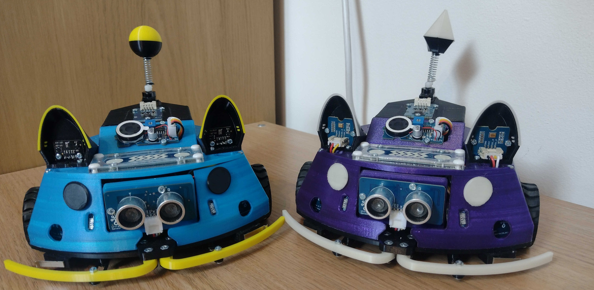

# PB3D
PB3D the 3D printed pet robot! Powered by Arduino and built with a 3D printer. Once you have built your robot friend they should look comething like this (previous chassis version with ultrasonic rangers):

||
|:--:|
|*PB3D and PHOEBE the 3D printed pet robots.* |

## Code
The main PB3D program is run on an Adafruit Metro M4 and the code can be found in the PB3D-core folder. Global constants for the core program including pinouts and an i2c address map can be found in the PB3D-constants folder. There are two sub-boards which are Seeduino Xiaos which are used for packet radio transmissions and echo location using the microphones in the ears.

## CAD Design Files
The CAD files and 3D printing files for PB3D can be found here: https://github.com/ScepticalRabbit/PB3D-CAD

